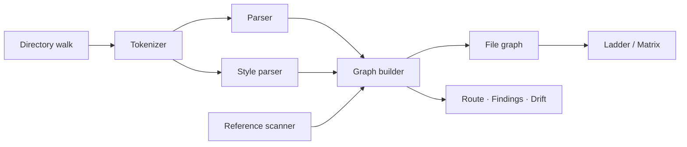

<div align="center">

# Atlas

**Read a codebase you have never seen.**

A native macOS app that analyses a project and answers the three questions a
newcomer actually has: what is this, how is it wired, and where do I start.

[]()
[]()
[]()
[]()
[]()

[O'zbekcha →](README.uz.md)

</div>

---

## The problem

Your editor shows you **files**. But code doesn't run as files — it runs as a
**graph**. A file tree tells you how one developer arranged things on disk. It
says nothing about what actually calls what, so every time you open an
unfamiliar project you rebuild that graph by hand, one `go to definition` at a
time, and human working memory holds about seven things.

[Sourcetrail](https://github.com/CoatiSoftware/Sourcetrail) solved this and was
discontinued in 2021. Nothing native replaced it on macOS.

---

## Four ways to look at a project

### Atlas — the shape

Opens with a plain-language answer to *what is this*: `flask` is a **web
framework**, and here is what a framework is. Then the figures, an ordered way
in, how the codebase divides into districts, and **Drift** — what moved since
the last scan.

### Map — the graph

Two drawings of the same dependency data.

**Ladder** places every file in a column by dependency depth, so arrows run left
to right and a backwards arrow is a cycle. **Matrix** answers who-depends-on-whom
with no lines at all: each file is a row and the same file is a column, a mark
at *(row, column)* means the row depends on the column. It does not degrade —
six hundred files read as clearly as six — and a **cycle is a pair of marks
reflected across the diagonal**, visible instead of traced.

### Read — the route

A numbered route through the code, starting where the program starts and
following the calls, so every step is reached by the one before it. Above the
source sits the **call chain**: how execution actually arrives at the line you
are looking at.

### Review — the findings

Six kinds of finding, all derived from the graph, each pointing at a real file
and line. Nothing here is generated by a language model.

---

## Two inks

The interface is set as a printed chart, and the two process inks carry meaning
rather than decoration:

| | Means | Where it appears |
|---|---|---|
| **Cyan** | downstream — what this calls | map edges, matrix rows, call chain arrows, blast radius |
| **Magenta** | upstream — what calls this | map edges, matrix columns, caller lists, new cycles in Drift |

Because the pairing never changes, direction never needs a legend. "You are
here" is set in ink weight rather than a third hue, so the two inks stay
unambiguous.

---

## Benchmarks

Measured on a **MacBook Air M4 (16 GB)**, `-O` build. Parse time covers
scanning, tokenising, parsing and cross-file resolution.

| Project | Language | Files | Lines | Symbols | Call edges | Parse |
|---|---|--:|--:|--:|--:|--:|
| [redis](https://github.com/redis/redis) | C | 333 | 241,121 | 8,359 | 20,622 | **0.05 s** |
| [express](https://github.com/expressjs/express) | JavaScript | 141 | 21,616 | 335 | 255 | 0.02 s |
| [flask](https://github.com/pallets/flask) | Python | 83 | 18,428 | 1,622 | 1,459 | 0.01 s |
| a static site | HTML/CSS/JS | 3 | 1,240 | 214 | 2 | 2 ms |

### Are the answers right?

Speed only matters if the analysis is correct. Asked for the most-called
functions in Redis, Atlas returns `sdslen`, `sdsfree`, `zfree`, `zmalloc`,
`sdsempty` — its string library and allocator, which is what anyone familiar
with the codebase would name. In Flask it surfaces `Scaffold.route`,
`Flask.url_for` and `render_template`.

Pointed at its own source, it names `Parser.parse` — 80 branches, 5 levels deep,
327 lines — as the hardest function to read. That is true.

---

## How it works



**Tokenizer** — a byte-level lexer working on UTF-8 rather than `Character`s,
because code is overwhelmingly ASCII and grapheme breaking is wasted work on
files that run to hundreds of thousands of lines. It consumes comments and
string bodies so a `(` inside a literal can never fabricate a call. The syntax
highlighter runs the same lexer with trivia enabled, which is why colouring can
never disagree with parsing about where a string ends.

**Parser** — a *shape* parser rather than a type checker. It recognises the
syntactic form of a declaration and the `name(` form of a call, tracking scope
through brace depth or indentation. It also measures each declaration's decision
points and nesting depth, which is where reading difficulty comes from.

**Style parser** — stylesheets and markup have no functions, so a separate pass
reads CSS rules, `@mixin`/`@include`, and the named elements of an HTML page.
Without it a static site analyses as nothing at all.

**Reference scanner** — `import`, `require`, `#include`, `<script src>`,
`<link href>`, `@import`, `url()`. Call edges alone miss how a front-end project
is actually wired.

**Graph builder** — resolves each call by scope-aware name matching: a method on
the receiver's type, then the caller's own type, then the same file, then a
unique match anywhere. Unresolved names optionally become external nodes.

**File graph** — the symbol graph aggregated one level up, because files are the
level people think in and there are two orders of magnitude fewer of them. Files
are classified into layers from path and content, cycles are found with Tarjan's
algorithm, and the heaviest dependencies are kept so dense C projects stay
drawable.

**Ladder layout** — columns from *dependency depth*, not from meaning. Semantic
layers were tried first and sent 70% of edges backwards, which draws as
spaghetti; depth puts callers left of callees. Meaning survives as colour.

| | Backward edges, semantic columns | Topological columns |
|---|--:|--:|
| flask | 200 / 283 | **25 / 75** |
| express | 73 / 100 | **3 / 39** |
| redis | 764 / 1003 | **2 / 130** |

---

## Explanations

Each function gets a plain-language description. Where Apple Intelligence is
enabled, Apple's **on-device** model is asked to classify the code along eight
axes — what it does, what it acts on, what goes in and comes out, when it runs,
whether it can fail, whether it changes state, whether it loops. Atlas writes
the sentences from those choices.

That indirection exists for a reason. The model refuses to generate Uzbek at
all, and Apple Translate has no Uzbek pair. Machine translation was evaluated
and rejected: NLLB-200 does support Uzbek, but it is trained on general prose and
renders exactly the vocabulary that matters here word-for-word and wrongly —
*thread* becomes the kind you sew with. Asking the model only to **choose**, and
writing every word ourselves, gives idiomatic Uzbek at no download cost and
keeps the technical terms correct. Classification accuracy measured around 85%;
the facts printed beneath it come from the parser and are always right.

Everything works without the model. The static explanation, the 44-term
glossary, and the per-operation beginner advice are all local.

---

## Languages

Swift · Python · JavaScript · TypeScript · C · C++ · Go · Java · Rust · Ruby ·
C# · PHP · Kotlin · HTML · CSS · SCSS · Vue · Svelte

Adding one means adding a case to `Language.swift`.

---

## Building

Requires macOS 14+ on Apple Silicon and the Xcode Command Line Tools. Full Xcode
is **not** needed.

```bash
xcode-select --install
```

```bash
git clone https://github.com/mahmudulashev/Atlas.git && cd Atlas && ./Scripts/build.sh run
```

```bash
./Scripts/make-dmg.sh
```

Builds are written to `~/Library/Caches/uz.atlas.build`, deliberately outside
the repo: this project is developed in an iCloud-synced folder, and iCloud stamps
`com.apple.FinderInfo` onto files, which makes `codesign` fail with *"resource
fork, Finder information, or similar detritus not allowed."*

The app icon and the disk-image background are both drawn in code
(`Scripts/make-icon.swift`, `Scripts/make-dmg-background.swift`), so the whole
build is reproducible from source with no binary assets checked in.

---

## Limitations

- **Name-based resolution.** Two functions with the same name may merge, and
  calls through function pointers, decorators, reflection or a router are
  invisible.
- **"Unreachable" means *suspicious*, not *dead*.** Zero fan-in is a hint.
  Framework callbacks legitimately have no visible callers.
- **No type inference.** `a.render()` and `b.render()` resolve by name and scope,
  not by knowing the types of `a` and `b`.
- **The widget does not appear.** It is written, built and embedded, but macOS
  only registers third-party extensions signed with an Apple Developer ID. The
  app renders the widget itself so the work is visible.
- **Ad-hoc signed.** Gatekeeper warns on first launch until the app is notarised.

---

## Built with

Swift 6.3 · SwiftUI · AppKit · WidgetKit · UserNotifications · FoundationModels

No third-party dependencies. The parser, graph, layout algorithms, syntax
highlighting and diagram rendering are all written here.

---

## Why "Atlas"

An atlas is not one map — it is a bound collection of them, each drawn at the
scale its question needs. That is the shape of this app: the same codebase as an
overview, as a ladder, as a matrix, as a route, as a list of findings.

The interface ships in Uzbek and English, and the map view keeps its Uzbek name:
*xarita*.

## License

MIT
