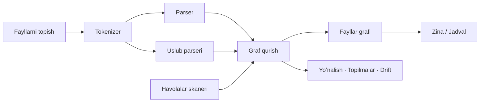

<div align="center">

# Atlas

**Hech koʻrmagan kodni oʻqi.**

macOS uchun native ilova. Loyihani tahlil qilib, notanish odamda tugʻiladigan
uchta savolga javob beradi: bu nima, qanday ulangan, va qayerdan boshlash kerak.

[]()
[]()
[]()
[]()
[]()

<br/>

<a href="https://github.com/mahmudulashev/Atlas/releases/latest/download/Atlas-1.0.dmg">
  
</a>
<a href="https://github.com/mahmudulashev/Atlas/releases">
  
</a>

<br/><br/>

[English →](README.md)

</div>

---

## Muammo

Muharriring senga **fayllarni** koʻrsatadi. Lekin kod fayl boʻlib ishlamaydi —
u **graf** boʻlib ishlaydi. Fayllar daraxti bitta dasturchi fayllarni diskda
qanday joylashtirganini aytadi, xolos. Nima nimani chaqirishi haqida hech narsa
demaydi. Shuning uchun har safar notanish loyihani ochganingda, oʻsha grafni
bittalab `go to definition` bosib, oʻz miyangda qurasan. Inson xotirasi esa bir
vaqtda taxminan yettita narsani ushlab tura oladi.

[Sourcetrail](https://github.com/CoatiSoftware/Sourcetrail) buni hal qilgandi va
2021-yilda yopildi. macOS uchun uning oʻrnini bosadigan native dastur chiqmadi.

---

## Loyihaga toʻrt xil qarash

### Atlas — shakli

Ochilishi bilan odam tilida javob beradi: `flask` — bu **veb-freymvork**, va
freymvork nimaligi ham tushuntiriladi. Keyin raqamlar, tartibli kirish yoʻli,
loyihaning mahallalarga boʻlinishi va **Drift** — oxirgi skandan beri nima
oʻzgargani.

### Atlas — grafi

Bir xil maʼlumotning ikki xil chizmasi.

**Zina** har bir faylni bogʻliqlik chuqurligi boʻyicha ustunga qoʻyadi, shuning
uchun strelkalar chapdan oʻngga yuguradi va orqaga ketgan strelka — aylanma
bogʻliqlik. **Jadval** esa kim kimga bogʻliqligini **umuman chiziqsiz** koʻrsatadi:
har bir fayl bir vaqtda qator ham, ustun ham; *(qator, ustun)* dagi belgi qator
faylning oʻsha ustun fayliga bogʻliqligini bildiradi. U yomonlashmaydi — olti yuz
fayl oltitasi kabi oʻqiladi — va **aylanma bogʻliqlik diagonal boʻyicha aks etgan
juft belgi** boʻlib koʻrinadi, izlash shart emas.

### Oʻqish — yoʻnalish

Kod boʻylab raqamlangan yoʻl: dastur boshlanadigan joydan boshlanib, chaqiruvlar
boʻylab boradi, shuning uchun har bir bosqichga oldingisidan yetib kelinadi. Kod
ustida **chaqiruv zanjiri** turadi: dastur sen qarab turgan qatorga aslida qanday
yetib keladi.

### Koʻrib chiqish — topilmalar

Olti xil topilma, hammasi grafdan olingan, har biri aniq fayl va qatorni
koʻrsatadi. Bironta ham til modeli tomonidan oʻylab topilmagan.

---

## Ikki siyoh

Interfeys bosma jadval kabi tuzilgan, va ikkita bosma siyoh bezak emas, **maʼno**
tashiydi:

| | Maʼnosi | Qayerda |
|---|---|---|
| **Siyan** | quyi oqim — bu nimani chaqiradi | atlas chiziqlari, jadval qatorlari, zanjir strelkalari, taʼsir doirasi |
| **Magenta** | yuqori oqim — buni kim chaqiradi | atlas chiziqlari, jadval ustunlari, chaqiruvchilar, Drift'dagi yangi aylanmalar |

Bu juftlik hech qachon oʻzgarmagani uchun yoʻnalishni tushuntirishga izoh kerak
emas. "Shu yerdasiz" esa uchinchi rang bilan emas, **siyoh ogʻirligi** bilan
belgilanadi — shunda ikki siyoh sof qoladi.

---

## Oʻlchangan natijalar

**MacBook Air M4 (16 GB)**, `-O` bilan. Vaqt ichiga fayllarni topish,
tokenizatsiya, parsing va fayllararo bogʻlash kiradi.

| Loyiha | Til | Fayl | Qator | Simvol | Chaqiruv | Vaqt |
|---|---|--:|--:|--:|--:|--:|
| [redis](https://github.com/redis/redis) | C | 333 | 241 121 | 8 359 | 20 622 | **0.05 s** |
| [express](https://github.com/expressjs/express) | JavaScript | 141 | 21 616 | 335 | 255 | 0.02 s |
| [flask](https://github.com/pallets/flask) | Python | 83 | 18 428 | 1 622 | 1 459 | 0.01 s |
| statik sayt | HTML/CSS/JS | 3 | 1 240 | 214 | 2 | 2 ms |

### Javoblar toʻgʻrimi?

Tezlik faqat tahlil toʻgʻri boʻlsagina maʼnoga ega. Redis'da eng koʻp
chaqiriladigan funksiyalar deb `sdslen`, `sdsfree`, `zfree`, `zmalloc`,
`sdsempty` chiqadi — bular uning satrlar kutubxonasi va xotira ajratuvchisi,
yaʼni Redis kodini bilgan odam aynan shularni aytadi. Flask'da esa
`Scaffold.route`, `Flask.url_for` va `render_template`.

Oʻz kodiga qaratilganda `Parser.parse` ni eng murakkab funksiya deb koʻrsatadi —
80 ta shart, 5 qavat ichma-ichlik, 327 qator. Bu rost.

---

## Qanday ishlaydi



**Tokenizer** — bayt darajasidagi lekser. `Character` emas, UTF-8 baytlar bilan
ishlaydi, chunki kod deyarli butunlay ASCII, va yuz minglab qatorli faylda
grapheme hisoblash bekorga sarflangan vaqt. Izohlar va satr ichidagi matnni
yutib yuboradi — shuning uchun satr ichidagi `(` hech qachon soxta chaqiruv
yasay olmaydi. Sintaksis ranglagich **xuddi shu lekserni** ishlatadi, faqat
izohlarni ham qaytaradigan rejimda — shu sababli rang ajratish va parsing satr
qayerda tugashi haqida hech qachon zid kelmaydi.

**Parser** — tip tekshiruvchi emas, **shakl** taniydigan parser. Eʼlonning
sintaktik koʻrinishini va chaqiruvning `name(` shaklini taniydi, qamrovni tilga
qarab qavs chuqurligi yoki chekinish boʻyicha kuzatadi. Shu bilan birga har bir
eʼlonning shartlar soni va ichma-ich chuqurligini oʻlchaydi — oʻqish qiyinligi
shundan chiqadi.

**Uslub parseri** — CSS va HTML'da funksiya yoʻq, shuning uchun alohida oʻtish
CSS qoidalarini, `@mixin`/`@include` larni va HTML sahifasining nomlangan
elementlarini oʻqiydi. Usiz sof frontend loyiha butunlay boʻsh koʻrinardi.

**Havolalar skaneri** — `import`, `require`, `#include`, `<script src>`,
`<link href>`, `@import`, `url()`. Faqat funksiya chaqiruvlari frontend
loyihaning haqiqiy tuzilishini koʻrsata olmaydi.

**Graf qurish** — har bir chaqiruvni qamrovga qarab bogʻlaydi: avval qabul
qiluvchi tipdagi metod, keyin chaqiruvchining oʻz tipidagisi, keyin oʻsha
fayldagisi, oxirida butun loyihada yagona mos kelgani.

**Fayllar grafi** — simvollar grafi bir daraja yuqoriga umumlashtiriladi, chunki
odamlar aynan fayl darajasida oʻylaydi va fayllar ikki tartib kam. Fayllar yoʻl
va mazmuniga qarab qatlamlarga ajratiladi, aylanma bogʻliqliklar Tarjan
algoritmi bilan topiladi.

**Zina joylashuvi** — ustunlar maʼno boʻyicha emas, **bogʻliqlik chuqurligi**
boʻyicha. Avval maʼno boʻyicha qilingandi va chiziqlarning 70% i orqaga qaytgandi
— bu spagetti boʻlib chizilardi. Chuqurlik esa chaqiruvchini chaqirilganning
chap tomoniga qoʻyadi. Maʼno esa rangda qoldi.

| | Maʼno boʻyicha ustunlar | Chuqurlik boʻyicha |
|---|--:|--:|
| flask | 200 / 283 | **25 / 75** |
| express | 73 / 100 | **3 / 39** |
| redis | 764 / 1003 | **2 / 130** |

---

## Tushuntirishlar

Har bir funksiya odam tilida tavsif oladi. Apple Intelligence yoqilgan boʻlsa,
Apple'ning **qurilma ichidagi** modelidan kodni sakkizta oʻlchov boʻyicha
tasniflash soʻraladi: nima qiladi, nimaga tegadi, nima kiradi va nima chiqadi,
qachon ishlaydi, xato beradimi, holatni oʻzgartiradimi, takrorlanadimi. Gaplarni
esa Atlas oʻzi yozadi.

Bu aylanma yoʻlning sababi bor. Model oʻzbek tilida umuman yoza olmaydi, Apple
Translate'da esa oʻzbek juftligi yoʻq. Mashina tarjimasi koʻrib chiqildi va rad
etildi: NLLB-200 oʻzbekchani qoʻllab-quvvatlaydi, lekin u oddiy matnlarda
oʻrgatilgan va aynan bu yerda muhim boʻlgan atamalarni soʻzma-soʻz, notoʻgʻri
tarjima qiladi — *thread* kiyim tikadigan **ip** boʻlib qoladi. Modeldan faqat
**tanlash** soʻrab, har bir soʻzni oʻzimiz yozganimizda esa oʻzbekcha tabiiy
chiqadi, hech narsa yuklab olinmaydi va atamalar toʻgʻri qoladi. Tasniflash
aniqligi ~85% oʻlchandi; pastdagi aniq maʼlumot esa parserdan keladi va har doim
toʻgʻri.

Modelsiz ham hammasi ishlaydi: statik tushuntirish, 44 ta atamali lugʻat va har
bir funksiya turi uchun boshlovchiga maslahat — hammasi mahalliy.

---

## Tillar

Swift · Python · JavaScript · TypeScript · C · C++ · Go · Java · Rust · Ruby ·
C# · PHP · Kotlin · HTML · CSS · SCSS · Vue · Svelte

Yangi til qoʻshish uchun `Language.swift` ga bitta case qoʻshiladi.

---

## Oʻrnatish

### 1-usul: Tayyor DMG faylini yuklab olish (Tavsiya etiladi)

1. Eng soʻnggi **[Atlas-1.0.dmg](https://github.com/mahmudulashev/Atlas/releases/latest/download/Atlas-1.0.dmg)** faylini yuklab oling (yoki barcha [versiyalarni koʻring](https://github.com/mahmudulashev/Atlas/releases)).
2. `Atlas-1.0.dmg` faylini oching va **Atlas** ilovasini **Applications** papkasiga torting.
3. Spotlight yoki Applications papkasidan **Atlas**ni ishga tushiring.

> [!TIP]
> **Birinchi marta ochishda (Gatekeeper ogohlantirishi)**: Ilova hozirda ad-hoc imzolangani sababli, macOS birinchi ochilishda ogohlantirishi mumkin. Agar ochilmasa, Finder'da `Atlas.app` ustiga oʻng tugmani (yoki Control-click) bosib **Open (Ochish)** ni tanlang, yoki Terminal'da quyidagi bitta qator buyruqni bering:
> ```bash
> xattr -cr /Applications/Atlas.app
> ```

---

## Koddan Yigʻish

macOS 14+ va Apple Silicon, hamda Xcode Command Line Tools kerak. Toʻliq Xcode **shart emas**.

```bash
xcode-select --install
```

```bash
git clone https://github.com/mahmudulashev/Atlas.git && cd Atlas && ./Scripts/build.sh run
```

Tarqatish uchun `.dmg` paketini yaratish:
```bash
./Scripts/make-dmg.sh
```

Build repo ichiga emas, `~/Library/Caches/uz.atlas.build` ichiga yoziladi. Bu
ataylab: loyiha iCloud bilan sinxronlanadigan papkada turadi, iCloud esa
fayllarga `com.apple.FinderInfo` belgisini qoʻshadi va `codesign` *"resource
fork, Finder information, or similar detritus not allowed"* xatosini beradi.

Ilova ikonkasi ham, disk obrazining foni ham kodda chiziladi
(`Scripts/make-icon.swift`, `Scripts/make-dmg-background.swift`) — shuning uchun
butun build faqat manba kodidan qayta yigʻiladi, birorta ham tayyor rasm
saqlanmaydi.

---

## Cheklovlar

- **Nom boʻyicha bogʻlash.** Bir xil nomli ikki funksiya birlashib ketishi
  mumkin. Funksiya koʻrsatkichlari, dekoratorlar, refleksiya yoki router orqali
  chaqiruvlar koʻrinmaydi.
- **"Ishlatilmagan" degani "oʻlik" degani emas.** Nol chaqiruv — bu ishora.
  Framework callback'larining koʻrinadigan chaqiruvchisi boʻlmasligi tabiiy.
- **Tip chiqarish yoʻq.** `a.render()` va `b.render()` tip boʻyicha emas, nom va
  qamrov boʻyicha bogʻlanadi.
- **Widget koʻrinmaydi.** U yozilgan, yigʻilgan va ilova ichiga joylashtirilgan,
  lekin macOS uchinchi tomon kengaytmalarini faqat Apple Developer ID bilan
  imzolangan boʻlsa roʻyxatga oladi. Shuning uchun ilova widget'ni oʻzi chizib
  koʻrsatadi.
- **Ad-hoc imzo.** Gatekeeper birinchi ochilishda ogohlantiradi.

---

## Nimadan qurilgan

Swift 6.3 · SwiftUI · AppKit · WidgetKit · UserNotifications · FoundationModels

Tashqi kutubxona yoʻq. Parser, graf, joylashtirish algoritmlari, sintaksis
ranglash va diagramma chizish — hammasi shu yerda yozilgan.

---

## Nega "Atlas"?

Atlas — bitta xarita emas, **xaritalar toʻplami**, va har biri oʻz savoliga mos
masshtabda chizilgan. Ilovaning shakli ham shunday: bitta loyiha — umumiy
koʻrinish, zina, jadval, yoʻnalish va topilmalar roʻyxati sifatida.

Interfeys oʻzbek va ingliz tillarida, xarita koʻrinishi esa oʻz nomini saqlab
qoldi: *xarita*.

## Litsenziya

MIT
